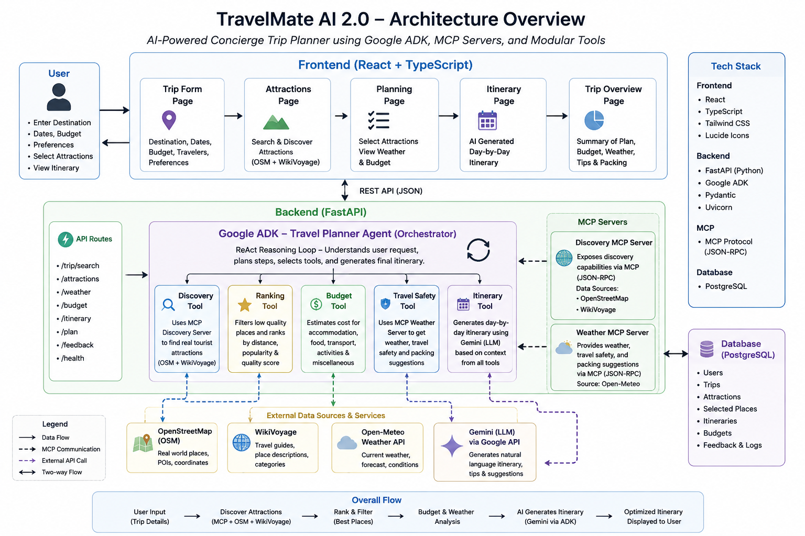

# 🎥 Demo Video

Watch the complete project demonstration on YouTube:
👉 https://youtu.be/DITw7D7GzRE

# 🌍 TravelMate AI 2.0

> An AI-powered Concierge Travel Planner built using **Google ADK**, **MCP Servers**, **FastAPI**, **React**, and **Google Gemini** to generate intelligent, personalized travel itineraries.


---

# 📖 Overview

TravelMate AI 2.0 is an AI-powered travel planning assistant developed as part of the **Kaggle 5-Day AI Agents: Intensive Vibe Coding with Google** capstone project.

Unlike traditional travel planners, TravelMate allows users to:

- Discover real tourist attractions
- Select only the places they want to visit
- Receive an optimized AI-generated itinerary
- Get budget estimation
- Check travel safety information
- Build trips using a modular AI agent architecture

The project combines deterministic workflows with Large Language Models to provide a structured and explainable travel planning experience.

---

# ✨ Features

### 🗺 Real Attraction Discovery

- OpenStreetMap Integration
- No fake or hallucinated places
- Attraction filtering
- Quality ranking

---

### 🤖 AI Itinerary Generation

- Google Gemini powered itinerary generation
- Day-wise trip planning
- Personalized schedules
- Structured JSON responses

---

### 💰 Budget Planning

- Travel budget estimation
- Accommodation cost
- Food estimation
- Transportation estimation
- Miscellaneous expenses

---

### 🌦 Travel Safety

- Weather information
- Travel safety recommendations
- Risk awareness

---

### 🧠 Google ADK Workflow

TravelMate uses Google's Agent Development Kit (ADK) to orchestrate the planning workflow.

Workflow includes:

- Geocoding
- Attraction Discovery
- Attraction Ranking
- Budget Calculation
- Weather Check
- AI Itinerary Generation

---

### 🔌 MCP Servers

TravelMate integrates Model Context Protocol (MCP) servers for external services.

Implemented MCP Servers:

- Discovery MCP Server
- Weather MCP Server

---

# 🏗 System Architecture

```
                    User
                     │
                     ▼
             React Frontend
                     │
                     ▼
              FastAPI Backend
                     │
                     ▼
          Google ADK Workflow
                     │
      ┌──────────────┼──────────────┐
      │              │              │
      ▼              ▼              ▼
 Discovery Tool   Budget Tool   Safety Tool
      │
      ▼
 Ranking Tool
      │
      ▼
 Itinerary Tool (Gemini)
      │
      ▼
 Generated Travel Plan
```

---

# 🛠 Tech Stack

## Frontend

- React
- TypeScript
- Vite
- Tailwind CSS
- Framer Motion

---

## Backend

- FastAPI
- Python
- SQLite
- Pydantic

---

## AI & Agent Framework

- Google Gemini
- Google ADK
- MCP Servers

---

## External Services

- OpenStreetMap
- Overpass API
- Open-Meteo API

---

# 📂 Project Structure

```
TravelMateAi
│
├── backend
│   ├── agent
│   │   ├── tools
│   │   ├── adk_agent.py
│   │   └── travel_planner_agent.py
│   │
│   ├── routes
│   ├── services
│   ├── models
│   ├── mcp_servers
│   ├── database
│   └── main.py
│
├── frontend
│   ├── src
│   ├── public
│   └── package.json
│
├── docs
│
├── README.md
└── LICENSE
```

---

# ⚙ Installation

## Clone Repository

```bash
git clone https://github.com/Akxay12/TravelMateAi.git

cd TravelMateAi
```

---

## Backend

```bash
cd backend

pip install -r requirements.txt

uvicorn main:app --reload
```

Backend runs on:

```
http://localhost:8000
```

API Documentation:

```
http://localhost:8000/docs
```

---

## Frontend

```bash
cd frontend

npm install

npm run dev
```

Frontend:

```
http://localhost:5173
```

---

# 🔑 Environment Variables

Create a `.env` file inside the backend directory.

```
GEMINI_API_KEY=YOUR_API_KEY

GEMINI_MODEL=gemini-2.5-flash
```

---

# 🔄 Workflow

1. User enters trip details.
2. Geocoding resolves destination.
3. Discovery Tool finds attractions.
4. Ranking Tool sorts attractions.
5. User selects preferred attractions.
6. Budget Tool estimates expenses.
7. Safety Tool checks travel conditions.
8. Google Gemini generates a structured itinerary.
9. Final itinerary is displayed in the frontend.

---

# 📸 Screenshots

Project screenshots are available inside the `docs/` directory.

Examples include:

- Home Page
- Trip Form
- Attraction Selection
- AI Generated Itinerary
- System Architecture

---

# 🎥 Demo Video

Demo Video:

**(Add your YouTube link here)**

Example:

```
https://youtu.be/your-video-link
```

---

# 🚀 Future Improvements

- Hotel Recommendation
- Flight Integration
- Google Maps Navigation
- Live Events
- Expense Tracking
- Collaborative Trip Planning
- Offline Mode

---

# 🏆 Kaggle Capstone

This project was developed for:

**Kaggle 5-Day AI Agents: Intensive Vibe Coding with Google**

The implementation demonstrates:

- ✅ Google ADK
- ✅ MCP Servers
- ✅ AI Agent Workflow
- ✅ Tool-based Architecture
- ✅ FastAPI Backend
- ✅ React Frontend
- ✅ AI-powered Itinerary Generation

---

# 👨‍💻 Author

**Akshay Patil**

BCA Student | Java Full Stack Developer | AI Enthusiast

GitHub:

https://github.com/Akxay12

LinkedIn:

https://www.linkedin.com/in/akshay-patil-507749360

---

# 📄 License

This project is licensed under the MIT License.
